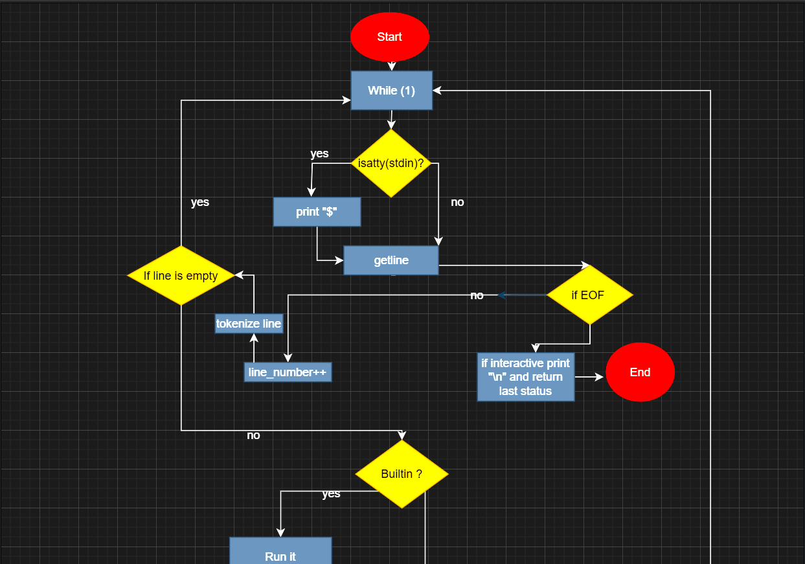
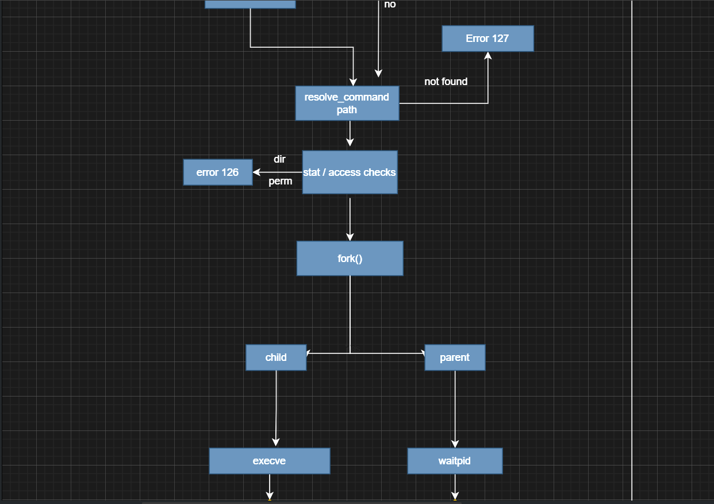
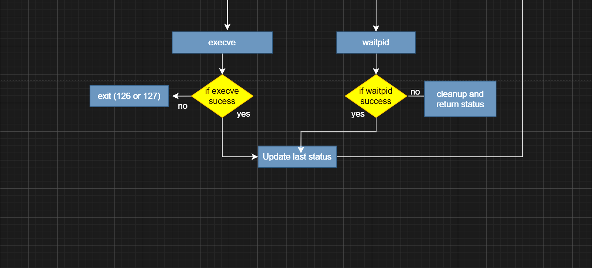

# Simple Shell (hsh)

## Description

**hsh** is a simple UNIX command interpreter written in C.  
It is a minimal shell that reproduces basic behaviors of `/bin/sh`, developed as part of the **Holberton School – Simple Shell** project.

The shell supports:
- Interactive and non-interactive modes
- Command execution using `fork`, `execve`, and `waitpid`
- Command resolution using the `PATH` environment variable
- Error handling with standard UNIX exit codes
- Basic built-in commands

---

## Compilation

Compile the shell using:

```bash
gcc -Wall -Werror -Wextra -pedantic -std=gnu89 *.c -o hsh
```
Usage
Interactive mode
```bash

$ ./hsh
$ ls
$ /bin/ls
$ env
$ exit
```
Non-interactive mode
```bash

echo "/bin/ls" | ./hsh
```
Features
Displays a prompt ($ ) in interactive mode

Reads input using getline

Tokenizes input into arguments

Resolves commands using absolute paths or PATH

Verifies:

command existence

execution permissions

directory execution attempts

Executes commands in a child process

Retrieves exit status correctly using waitpid

Returns proper exit codes:

0 → success

126 → permission denied or directory

127 → command not found

Built-in Commands
Command	Description
exit	Exit the shell with the last command status
env	Print the current environment

Man Page (Integrated)
NAME
hsh — simple UNIX command interpreter

SYNOPSIS
```bash

./hsh
```

DESCRIPTION
hsh is a minimal shell capable of executing simple commands.
It supports command resolution through the PATH environment variable
and handles standard UNIX errors.

BUILT-INS
exit

env

RETURN VALUES
0 Success

126 Permission denied or directory

127 Command not found

## Flowchart

### Main Shell Loop


### Command Resolution and Validation


### Execution and Exit Status Handling


Project Structure
File	Description
main.c	Main loop and user interaction
parser.c	Parsing, built-ins, PATH handling
executor.c	Command resolution, validation, execution
builtins.c	Environment printing
shell.h	Function prototypes and definitions

Limitations

This shell does not support:

Pipes (|)

Redirections (>, <)

Logical operators (&&, ||)

Variable expansion ($VAR)

Wildcards (*)

History

Advanced signal handling

Notes

The shell is Valgrind clean

fork() is never called if the command is invalid

Exit statuses strictly follow UNIX conventions